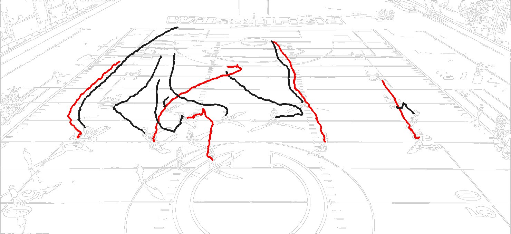
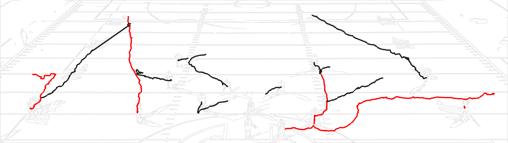

# Football Player Movement Tracker

Real-time player tracking and trail visualization for football film analysis. Click players on live video to assign them to teams — the tool builds color-coded movement trails and exports them as PNG overlaid on the field.

Built with **YOLOv8** + **BotSORT** + **OpenCV**.

---

## Demo

<p align="center">
  
  <br/>
  <em>Multi-player trail map — red team vs. black team routes overlaid on Canny edge-detected field</em>
</p>

<p align="center">
  
  <br/>
  <em>Route traces over a longer play sequence — each line is a single player's path</em>
</p>

---

## Features

- **Real-time detection** — YOLOv8m detects players on every frame at 1280px resolution
- **Persistent identity** — BotSORT tracker keeps player IDs stable across frames using optical flow and appearance cues
- **Interactive assignment** — pause the video and click any bounding box to assign that player to a team
- **Two-team color coding** — red vs. black trail visualization with per-player ID labels
- **Trail export** — saves a PNG of all trails overlaid on a Canny edge map of the field background
- **Non-destructive workflow** — reset, reassign, and re-export without restarting

---

## How It Works

```
Video frame → YOLOv8m detection → BotSORT tracking → Persistent IDs
                                                            ↓
                                               User clicks to assign team
                                                            ↓
                                          Centroid logged each frame → Trail
                                                            ↓
                                       Export PNG over Canny field edge map
```

1. **Detection** — YOLOv8m runs on each frame at `imgsz=1280`, detecting people (`class=0`) with a low confidence threshold (`0.15`) to catch partially occluded players
2. **Tracking** — BotSORT assigns persistent IDs using sparse optical flow + configurable appearance thresholds (see `custom_tracker.yaml`)
3. **Assignment** — pause playback, then click any bounding box to assign that player to Team 1 (red) or Team 2 (black); click again to deassign
4. **Trail building** — the centroid of each selected player's box is recorded every frame
5. **Visualization** — trails are drawn over a Canny edge map extracted from the first frame, giving a clean field outline as background

---

## Tech Stack

| Tool | Role |
|------|------|
| [Ultralytics YOLOv8](https://github.com/ultralytics/ultralytics) | Object detection + tracking backbone |
| OpenCV | Video I/O, annotation, mouse callbacks, image export |
| BotSORT | Multi-object tracker (tuned via `custom_tracker.yaml`) |
| NumPy | Canvas construction for trail export |

---

## Setup

```bash
# 1. Clone and create a virtual environment
git clone <repo-url>
cd football-tracker
python -m venv .venv
source .venv/bin/activate   # Windows: .venv\Scripts\activate

# 2. Install dependencies
pip install ultralytics opencv-python numpy

# 3. Download a YOLOv8 model weight and place it in the project root
#    https://github.com/ultralytics/assets/releases — yolov8m.pt recommended

# 4. Place your footage at:
#    vids/FootbalVid24k.mp4
```

---

## Usage

```bash
python track_multi_best.py
```

### Controls

| Key / Action | Behavior |
|---|---|
| `Space` | Pause / resume playback |
| `1` | Switch active team to **Red** |
| `2` | Switch active team to **Black** |
| **Click** (while paused) | Assign / deassign the clicked player to the active team |
| `S` | Save trail map to `output/` |
| `R` | Reset all selections and trails |
| `Q` | Save trail map and quit |

Trail images are saved to `output/trails_<timestamp>.png`.

---

## Configuration

Tracking behavior is controlled by `custom_tracker.yaml`:

```yaml
tracker_type: botsort
track_high_thresh: 0.25   # confidence to start a new track
track_buffer: 90          # frames to keep a lost track alive
match_thresh: 0.8         # IoU threshold for track matching
gmc_method: sparseOptFlow # global motion compensation
```

Lowering `track_high_thresh` or raising `track_buffer` improves recall on crowded or occluded frames.
